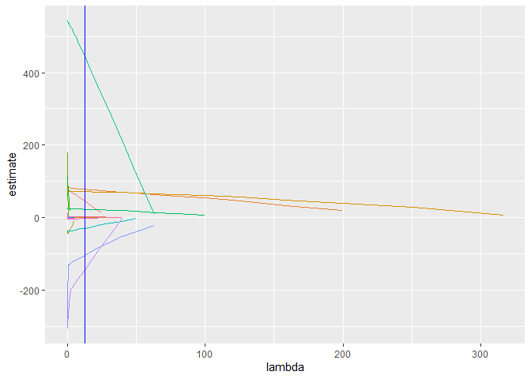
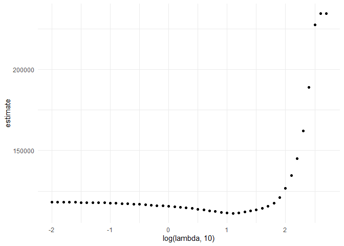
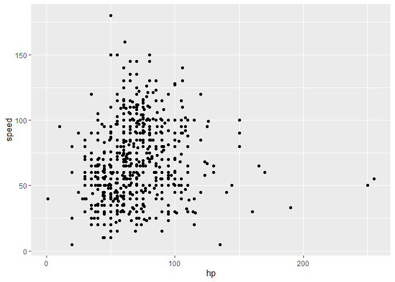
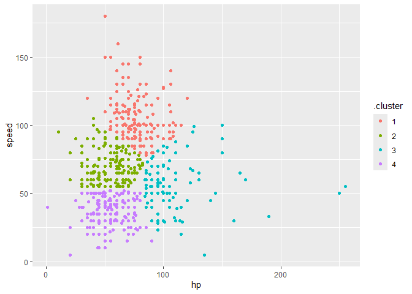

statistical learning
================

``` r
library(tidyverse)
```

    ## ── Attaching core tidyverse packages ──────────────────────── tidyverse 2.0.0 ──
    ## ✔ dplyr     1.1.4     ✔ readr     2.1.5
    ## ✔ forcats   1.0.0     ✔ stringr   1.5.1
    ## ✔ ggplot2   3.5.1     ✔ tibble    3.2.1
    ## ✔ lubridate 1.9.3     ✔ tidyr     1.3.1
    ## ✔ purrr     1.0.2     
    ## ── Conflicts ────────────────────────────────────────── tidyverse_conflicts() ──
    ## ✖ dplyr::filter() masks stats::filter()
    ## ✖ dplyr::lag()    masks stats::lag()
    ## ℹ Use the conflicted package (<http://conflicted.r-lib.org/>) to force all conflicts to become errors

``` r
library(glmnet)
```

    ## Warning: 程序包'glmnet'是用R版本4.4.2 来建造的

    ## 载入需要的程序包：Matrix
    ## 
    ## 载入程序包：'Matrix'
    ## 
    ## The following objects are masked from 'package:tidyr':
    ## 
    ##     expand, pack, unpack
    ## 
    ## Loaded glmnet 4.1-8

``` r
set.seed(11)
```

## Lasso.

``` r
bwt_df = 
  read_csv("./birthweight.csv") |> 
  janitor::clean_names() |>
  mutate(
    babysex = 
        case_match(babysex,
            1 ~ "male",
            2 ~ "female"
        ),
    babysex = fct_infreq(babysex),
    frace = 
        case_match(frace,
            1 ~ "white",
            2 ~ "black", 
            3 ~ "asian", 
            4 ~ "puerto rican", 
            8 ~ "other"),
    frace = fct_infreq(frace),
    mrace = 
        case_match(mrace,
            1 ~ "white",
            2 ~ "black", 
            3 ~ "asian", 
            4 ~ "puerto rican",
            8 ~ "other"),
    mrace = fct_infreq(mrace),
    #malform = as.logical(malform)
    ) |> 
  sample_n(200)
```

    ## Rows: 4342 Columns: 20
    ## ── Column specification ────────────────────────────────────────────────────────
    ## Delimiter: ","
    ## dbl (20): babysex, bhead, blength, bwt, delwt, fincome, frace, gaweeks, malf...
    ## 
    ## ℹ Use `spec()` to retrieve the full column specification for this data.
    ## ℹ Specify the column types or set `show_col_types = FALSE` to quiet this message.

construct input for glmnet.

``` r
x = model.matrix(bwt ~ ., bwt_df)[,-1]
y = bwt_df |> pull(bwt)
```

fit lasso for several lamdas.

``` r
lambda = 10^(seq(-2, 2.75, 0.1))

lasso_fit =
  glmnet(x, y, lambda = lambda)

lasso_cv =
  cv.glmnet(x, y, lambda = lambda)

lambda_opt = lasso_cv[["lambda.min"]]
```

``` r
lasso_fit |> 
  broom::tidy() |> 
  #select(term, lambda, estimate) |> 
  #complete(term, lambda, fill = list(estimate = 0) ) |> 
  filter(term != "(Intercept)") |> 
  ggplot(aes(x = lambda, y = estimate, group = term, color = term)) + 
  geom_line()+
  #geom_path() + 
  geom_vline(xintercept = lambda_opt, color = "blue", size = 0.6) +
  theme(legend.position = "none")
```

    ## Warning: Using `size` aesthetic for lines was deprecated in ggplot2 3.4.0.
    ## ℹ Please use `linewidth` instead.
    ## This warning is displayed once every 8 hours.
    ## Call `lifecycle::last_lifecycle_warnings()` to see where this warning was
    ## generated.

<!-- -->

``` r
final_lasso_fit = 
  glmnet(x, y, lambda = lambda_opt)

final_lasso_fit |> broom::tidy()
```

    ## # A tibble: 12 × 5
    ##    term               step  estimate lambda dev.ratio
    ##    <chr>             <dbl>     <dbl>  <dbl>     <dbl>
    ##  1 (Intercept)           1 -3659.      12.6     0.627
    ##  2 babysexfemale         1    46.2     12.6     0.627
    ##  3 bhead                 1    77.9     12.6     0.627
    ##  4 blength               1    71.8     12.6     0.627
    ##  5 fincome               1     0.252   12.6     0.627
    ##  6 gaweeks               1    23.1     12.6     0.627
    ##  7 malform               1   447.      12.6     0.627
    ##  8 menarche              1   -29.4     12.6     0.627
    ##  9 mraceblack            1  -105.      12.6     0.627
    ## 10 mracepuerto rican     1  -145.      12.6     0.627
    ## 11 smoken                1    -2.62    12.6     0.627
    ## 12 wtgain                1     2.32    12.6     0.627

``` r
lasso_cv |> 
  broom::tidy() |> 
  ggplot(aes(x = log(lambda, 10), y = estimate)) + 
  geom_point()+
  theme_minimal()
```

<!-- -->

## pokemon clustering

``` r
pokemon_df = 
  read_csv("./pokemon.csv") |> 
  janitor::clean_names() |> 
  select(hp, speed)
```

    ## Rows: 800 Columns: 13
    ## ── Column specification ────────────────────────────────────────────────────────
    ## Delimiter: ","
    ## chr (3): Name, Type 1, Type 2
    ## dbl (9): #, Total, HP, Attack, Defense, Sp. Atk, Sp. Def, Speed, Generation
    ## lgl (1): Legendary
    ## 
    ## ℹ Use `spec()` to retrieve the full column specification for this data.
    ## ℹ Specify the column types or set `show_col_types = FALSE` to quiet this message.

``` r
pokemon_df |> 
  ggplot(aes(x = hp, y = speed)) + 
  geom_point()
```

<!-- -->

use kmeans.

``` r
kmeans_fit =
  kmeans(x = pokemon_df, centers = 4)
```

``` r
pokemon_df =
  broom::augment(kmeans_fit, pokemon_df)

pokemon_df |> 
  ggplot(aes(x = hp, y = speed, color = .cluster)) +
  geom_point()
```

<!-- -->
